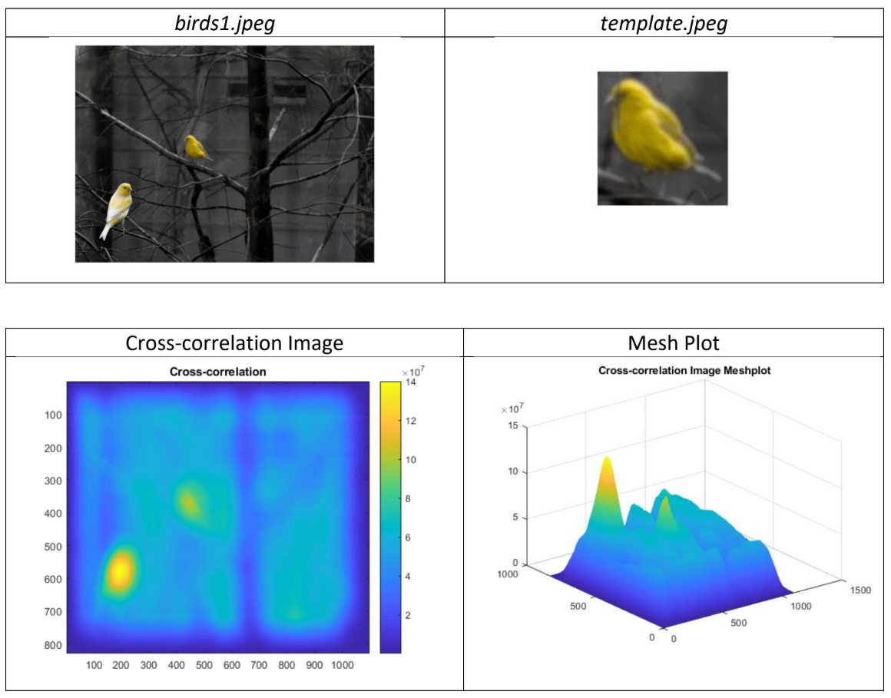
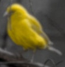
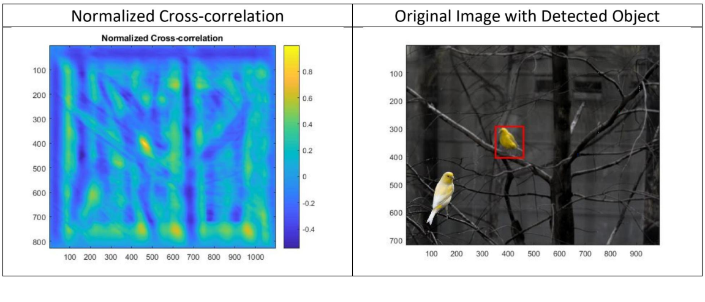
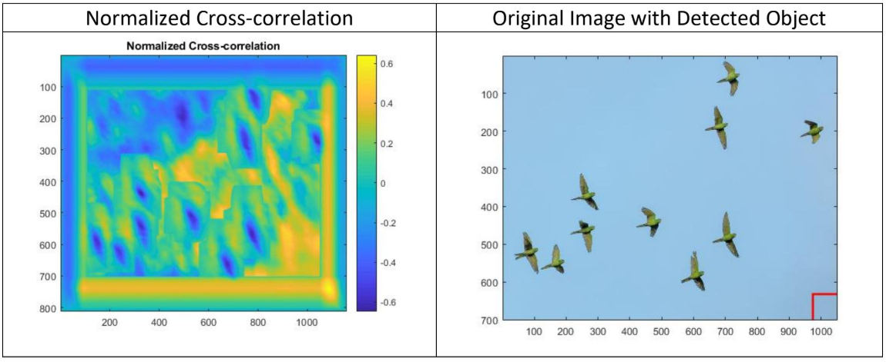

# Object-Detection

Object detection with template matching using a <b>cross-correlation filter</b>.

## Template Image

## Test 1 - Correct Detection = Matching Template

## Test 2 - Incorrect Detection = Non-matching Template

